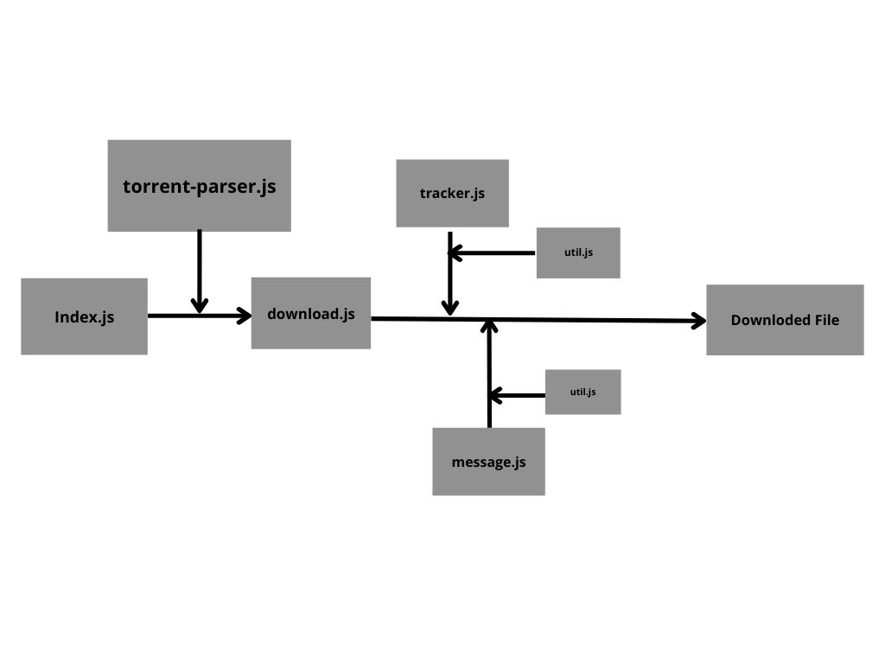

<h1 align="center"> TorrentBee </h1>

<p align = "center">
  
</p>


## :pushpin: Contents of this file :

- [Introduction](#introduction)
- [Built with](#built-with)
  - [Smaller libraries](#smaller-libraries)
- [How to install](#how-to-install)
- [How to use the project](#how-to-use-the-project)
- [Working](#working)
- [Understanding the code](#understanding-the-code)
- [Current functionality](#current-functionality)
- [Future enhancements](#future-enhancements)


## :zap: Introduction

This is a personal torrent client application which is currently a command line application which is made using nodejs. What's special about this torrent client is that it uses UDP for communication with tracker server instead of TCP which makes it faster.


## :wrench: Built with

* Node.js

### Smaller libraries

* bencode.js
* dgram.js
* net.js
* crypto.js
* Buffer.js
* bn.js


## :arrow_double_down: How to install

```
  git clone "https://github.com/Augilar/TorrentBee.git"
  cd TorrentBee
  npm install
  node index
```

## :hammer: How to use the project

- Download the torrent-info file of the file you want to download.
- Keep the torrent-info file in the same directory as that of the project.
- Run the application with the torrent file name as the argument. 
```
node index test-torrent3.torrent
```


## :mag: Working

Before going into detail let's first understand how a torrent client works in a simple way.

* Normally, if you want to share or download a file to/from another computer (node) then you make a connection with that computer and then send/recieve data packets.
* In Torrenting this happens in a different way. There is a tracker server which contains data regarding the IP addresses of the nodes which contains (partially contains) some specific files. And then a torrent file is circulated which is of very small size containg meta data of the file to be downloaded, tracker url and hashes of the file. Then when someone wants to download the file they will use the torrent file and send a request to the tracker URL which will reply with list of peers and then it will make connections with the set of peers and will request pieces of the files that it doesn't have.

Torrenting may seem complicated for simply downloading a file but it has its elegance

* In normal downloading (client server) if the connection is lost then connection is made again.
* But in torrenting if a connection with a peer is lost then there are many others through which downloading is possible.

* If only one has the original file then sharing of the file happens in such a way that each one has to wait for the others to complete.
* But in the case of torrent, even if the peer with the total file has lost the connection, others peers with only partia but different packets of data can send each other and doanloading can be completed.


## :thinking: Understanding the code

The following is the short description of what the contents of the files are.

* **index.js** - It is the main file, which we have to run and it will call necessary functions.
*  **download.js** - It contains functions required to make connections with peers and recieving data (as pieces and blocks).
*  **torrent-parser.js** - It contains functions which parses the torrent info file.
*  **tracker.js** - It contains functions dealing with buffers and sending connection requests to the tracker server in getting peer information in this file.
*  **util.js** - It contains functions to generate a unique id for the torrent client so that it can be recognized by the tracker server and the peers during the interaction.
*  **message.js** - It contains functions to identify and send different messages while communicating with the peers.
*  **Queue.js** - A class to store information of whether the torrent piece has been recieved or not.
*  **pieces.js** - A class to manipulate the piece data recieved from the peers.


The below diagram tries to show how the functions from different files are called and results finally downloading the required file.

<p align="center">
  
 <p/>


## :books: Resources

* [Allen Kim's Blog](https://allenkim67.github.io/programming/2016/05/04/how-to-make-your-own-bittorrent-client.html)
* [Kristewindman's Blog (recurse centre)](http://www.kristenwidman.com/blog/33/how-to-write-a-bittorrent-client-part-1/)
* [Unofficial documentation of bittorent](https://wiki.theory.org/index.php/BitTorrentSpecification)


## :fire: Current Functionality

* single file torrents
* Only downloading no uploading functionality
* command line application no frontend
* Various optimal algorithms for downloading the data packets can be implemented on top of the existing algorithm.


## :bulb: Future Enhancements

* Creating a frontend.
* Making it functional for multiple file downloads.
* Making uploads functional.
* Apply different algorithm for peer connections.
* A function to get the progress of download.
* Create a TCP version i.e. which sends a TCP requests instead of UDP (depends on the tracker URL).
* Make it functional with Magnet links. 
